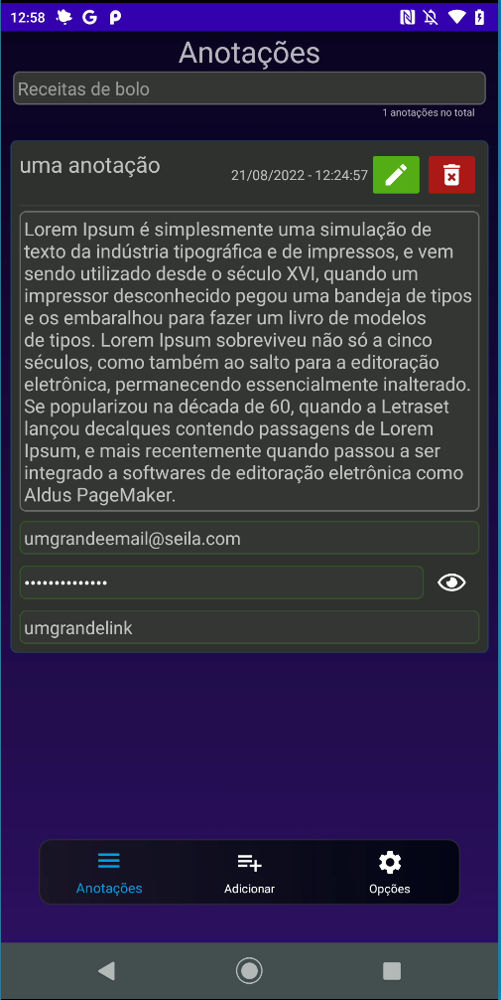

## Anotador app

### Resumo

Aplicativo de anotações feitos com interesse em aprendizado

### Tecnlogias

Java.

### O que ele faz

No momento, só cria, futuramente pretendo colocar mais opções.

### Download

[baixar anotador v1.0.6](https://github.com/josedoce/anotador/releases/download/sixth_app/Anotador_v1_0_6.apk) - 4.29mb

### Screenshots
 

### (Básico) Ainda falta:
- [x] Melhor visual do Card de anotação; 
- [x] Função de esconder e exibir senha; 
- [x] Modo Dioguardo - função de guardar e resgatar dados de usuário salvos no diretorio as anotações; 
- [x] Encriptação de dados da anotação; 
- [x] Descriptação de dados da anotação; 
- [x] Deleção precisa de anotações; 
- [x] Edição de dados da anotação; 
- [x] Mecanismo de busca de anotação; 
- [x] Deleção total de dados do usuário no aplicativo. 

### (Médio) Ainda falta:

- [ ] Upload dos dados criptografados; (futuramente) 
- [ ] Sincronização com dados no servidor; (futuramene)

